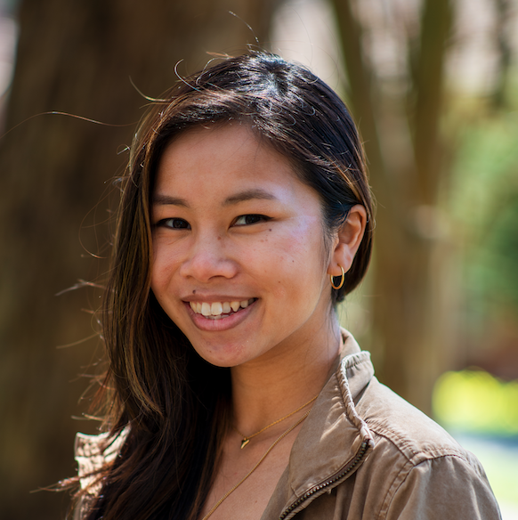

I am a research scientist at Netflix, working on computer vision applications in studio production. I earned my Ph.D. in Electrical Engineering while working in the [Stanford Computational Imaging Lab](https://www.computationalimaging.org/), 
advised by [Prof. Gordon Wetzstein](https://stanford.edu/~gordonwz/). Before that, I received my B.S. in Bioengineering also at Stanford, where I worked on CRISPR genome editing while advised by [Prof. Stanley Qi](https://med.stanford.edu/qilab/home.html) (which included a *lot* of pipetting). 

I'm passionate about supporting first-generation/low-income students, so feel free to reach out if you're an underrepresent student/person in tech! 
*Last updated: 09/30/2025*
