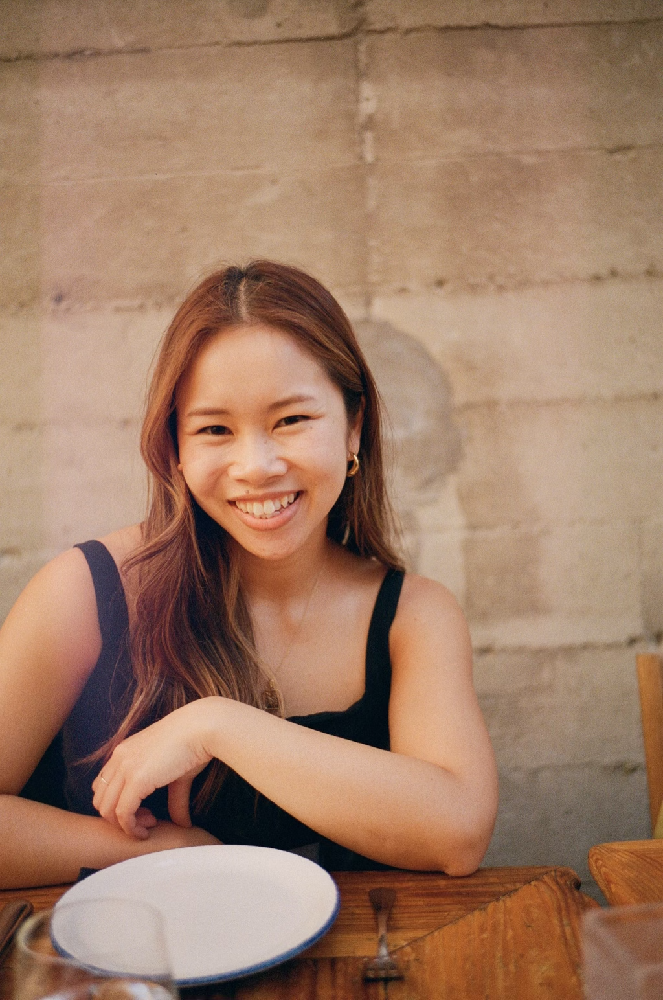

<b>Bay Area native, computer vision researcher, and thinking really hard about the third thing.</b>

I am a research scientist at [Netflix](https://research.netflix.com/), working on computer vision applications in studio production. I earned my Ph.D. in Electrical Engineering while working in the [Stanford Computational Imaging Lab](https://www.computationalimaging.org/), 
advised by [Prof. Gordon Wetzstein](https://stanford.edu/~gordonwz/). 

Before that, I received my B.S. in Bioengineering also at Stanford, where I worked on CRISPR genome editing while advised by [Prof. Stanley Qi](https://med.stanford.edu/qilab/home.html) (which included a *lot* of pipetting). Yes, I was a wet lab person in past life!

While I was at Stanford, I co-founded [STEM to SHTEM](https://compression.stanford.edu/outreach/shtem-summer-internships-high-schoolers-and-community-college-students) with [Prof. Tsachy Weissman](https://web.stanford.edu/~tsachy/) for high school and community college students to pursue summer research. Starting research [when I was 16](https://simr.stanford.edu/) was life-changing, so I'm grateful to help give that same experience to others.

Having grown up first-generation and low-income, I'm passionate about supporting underreprented minorities, so please reach out if you're a minority in research/tech and want to chat! 

*Last updated: 09/30/2025*
